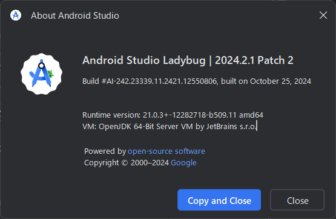

# android_study

## 使用技術一覧

<!-- シールド一覧 -->
<!-- 該当するプロジェクトの中から任意のものを選ぶ-->

## 目次

1. [プロジェクトについて](#プロジェクトについて)
2. [環境](#環境)
4. [開発環境構築](#開発環境構築)

<!-- プロジェクト名を記載 -->

## プロジェクト名

多言語で挨拶するアプリ

<!-- プロジェクトについて -->

## プロジェクトについて

Android端末の言語設定に応じた言語で、朝/昼/夜の挨拶を表示するアプリを実装

<!-- プロジェクトの概要を記載 -->

(<a href="#top">トップへ</a>)

## 環境

<!-- 言語、フレームワーク、ミドルウェア、インフラの一覧とバージョンを記載 -->

| 言語・フレームワーク  | バージョン |
| --------------------- | ---------- |
| Kotlin| 1.9.24|
| Java | 23.0.1|
| Android APIレベル|33|
| Android APIレベル|13|

| 使用端末  | バージョン |
| --------------------- | ---------- |
| 製品名            | Galaxy S20 5G（https://www.docomo.ne.jp/support/product/sc51a/spec.html）|
|モデル名|SC-51A|
|ディスプレイ（メイン）|約6.2インチ|

(<a href="#top">トップへ</a>)

## 開発環境

<!-- コンテナの作成方法、パッケージのインストール方法など、開発環境構築に必要な情報を記載 -->
- ホストPC
    - Windows 11 Home
    - 64 ビット オペレーティング システム、x64 ベース プロセッサ
- Android Studioバージョン
    - Android Studio Ladybug | 2024.2.1 Patch 2

(<a href="#top">トップへ</a>)

### READMEファイル参考

https://qiita.com/shun198/items/c983c713452c041ef787